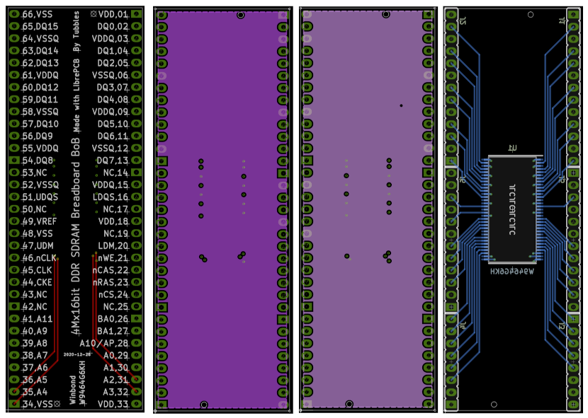

# bob_ddr_sdram_4m16b

## Description

This is a [LibrePCB](https://librepcb.org) project!

Breakout boards for breadboard and MachXO3 Starter Kit

For Winbond W9464G6KH 1M x 4 x 16bit DDR SDRAM

## License

See [LICENSE.txt](LICENSE.txt).

